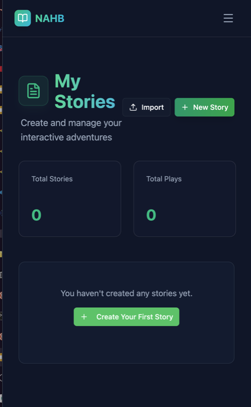

# Évaluation de chaque fonctionnalité

Pour faciliter la notation et les fonctionalités, voici un résumé des fonctionnalités du projet **NAHB (Not Another Hero's Book)**, son architecture technique, les fichiers lié aux différentes features et une justification des attentes pour atteindre la note maximale point par point.

## Architecture du Projet

Le projet est une application web fullstack moderne, séparée en deux dépôts (Frontend et Backend), suivant les meilleures pratiques de développement.

### Backend (`finale/NAHB-BackEnd`)
*   **Technologie** : Node.js avec TypeScript.
*   **Framework** : Express.js pour l'API REST.
*   **Base de Données** :
    *   **MongoDB** (via Mongoose) : Utilisé principalement pour la flexibilité des schémas (Histoires, Pages).
    *   **MySQL** (via Sequelize) : Intégré pour les données structurées et relationnelles (Utilisateurs, Authentification).
    *   **Architecture Hybride** : Le pattern **Repository** permet d'abstraire la source de données, rendant l'application agnostique à la base de données (SQL ou NoSQL).
*   **Architecture** : **Service Layer Pattern**.
    *   **Controllers** : Gèrent les requêtes HTTP et les réponses (`src/controllers`).
    *   **Services** : Contiennent la logique métier (`src/services`).
    *   **Repositories** : Gèrent l'accès aux données (`src/repositories`).
    *   **Middlewares** : Gèrent l'authentification (JWT), la validation des données et la gestion des erreurs (`src/middleware`).
*   **Sécurité** : Authentification via JWT (JSON Web Tokens), hachage des mots de passe avec bcrypt.

### Frontend (`finale/NAHB-FrontEnd`)
*   **Technologie** : React 19 avec TypeScript.
*   **Build Tool** : Vite pour des performances de développement et de build optimales.
*   **Architecture UI** : **Atomic Design**.
    *   **Atoms** : Composants de base (Boutons, Inputs, Badges) dans `src/components/atoms`.
    *   **Molecules** : Composants composés (StoryCard, HotspotLayer) dans `src/components/molecules`.
    *   **Organisms** : Composants complexes (Navigation, DiceRoller, StoryNode) dans `src/components/organisms`.
    *   **Templates** : Mises en page (MainLayout) dans `src/components/templates`.
*   **Gestion d'État & API** : Custom Hooks (`src/hooks/api`) pour encapsuler la logique d'appel API et la gestion d'état locale.
*   **Styling** : Tailwind CSS pour un design responsive et moderne, avec `lucide-react` pour les icônes.
*   **Fonctionnalités Avancées** :
    *   **React Flow** : Pour la visualisation et l'édition des histoires sous forme d'arbre interactif.
    *   **Interactivité** : Système de zones cliquables (Hotspots) sur les images.

---

## Évaluation des Fonctionnalités

### 1. Fonctionnalités de base (10/20) - ✅ Validé

*   **Authentification** :
    *   ✅ Inscription (Pseudo, Email, Mot de passe) (`finale/NAHB-BackEnd/src/controllers/authController.ts`).
    *   ✅ Connexion / Déconnexion avec gestion de session via JWT (`finale/NAHB-FrontEnd/src/hooks/api/useAuth.ts`).
*   **Gestion des histoires (Auteur)** :
    *   ✅ Création d'histoire (Titre, Description, Tags, Cover) (`finale/NAHB-FrontEnd/src/pages/StoryEditor.tsx`).
    *   ✅ Modification / Suppression (`finale/NAHB-BackEnd/src/controllers/storyController.ts`).
    *   ✅ Gestion du statut (Brouillon / Publié) (`finale/NAHB-BackEnd/src/models/mongoose/Story.ts`).
    *   ✅ Définition de la page de départ (`finale/NAHB-BackEnd/src/services/storyService.ts`).
*   **Pages / Scènes et Choix** :
    *   ✅ Création de pages avec contenu texte et média (`finale/NAHB-BackEnd/src/controllers/pageController.ts`).
    *   ✅ Indicateur de fin de page (`finale/NAHB-BackEnd/src/models/mongoose/Page.ts`).
    *   ✅ Ajout de choix multiples pointant vers d'autres pages (`finale/NAHB-FrontEnd/src/components/organisms/StoryNode.tsx`).
    *   ✅ Modification / Suppression dynamique (`finale/NAHB-FrontEnd/src/hooks/useStoryFlow.ts`).
*   **Lecture d'une histoire (Lecteur)** :
    *   ✅ Listing des histoires avec recherche et filtres (`finale/NAHB-FrontEnd/src/pages/StoryListing.tsx`).
    *   ✅ Navigation fluide entre les pages via les choix (`finale/NAHB-FrontEnd/src/pages/GamePlayer.tsx`).
    *   ✅ Affichage clair des fins (`finale/NAHB-FrontEnd/src/pages/GamePlayer.tsx`).
*   **Enregistrement des parties** :
    *   ✅ Sauvegarde automatique de la progression (Histoire, Page actuelle, Utilisateur) (`finale/NAHB-BackEnd/src/controllers/gameController.ts`).
*   **Gestion Admin** :
    *   ✅ Dashboard administrateur (`finale/NAHB-FrontEnd/src/pages/Admin.tsx`).
    *   ✅ Bannissement des utilisateurs (`finale/NAHB-BackEnd/src/controllers/adminController.ts`).
    *   ✅ Suspension des histoires (`finale/NAHB-BackEnd/src/services/adminService.ts`).
    *   ✅ Statistiques globales (`finale/NAHB-BackEnd/src/services/adminService.ts`).

### 2. Fonctionnalités avancées (13/20) - ✅ Validé

*   **Côté Lecteur** :
    *   ✅ Filtrage des histoires (par thème, recherche) (`finale/NAHB-FrontEnd/src/pages/StoryListing.tsx`).
    *   ✅ Statistiques de fin (nombre de fois atteinte) (`finale/NAHB-BackEnd/src/services/gameService.ts`).
    *   ✅ Statistiques de parcours (comparaison avec les autres joueurs) (`finale/NAHB-BackEnd/src/services/gameService.ts`).
    *   ✅ Collection de fins débloquées (Badges de succès/échec) (`finale/NAHB-FrontEnd/src/pages/Dashboard.tsx`).
    *   ✅ Système de notation (1-5 étoiles) et commentaires (`finale/NAHB-BackEnd/src/controllers/ratingController.ts`).
    *   ✅ Reprise de lecture (bouton "Continuer" sur le dashboard) (`finale/NAHB-FrontEnd/src/pages/Dashboard.tsx`).
    *   ✅ Signalement d'histoire inappropriée (`finale/NAHB-BackEnd/src/controllers/reportController.ts`).
*   **Côté Auteur** :
    *   ✅ Profil auteur avec liste des histoires (`finale/NAHB-FrontEnd/src/pages/MyStories.tsx`).
    *   ✅ Statistiques avancées (Vues, Note moyenne, Fins atteintes) (`finale/NAHB-BackEnd/src/services/userService.ts`).
    *   ✅ Mode Preview pour tester l'histoire sans affecter les stats (`finale/NAHB-FrontEnd/src/pages/GamePlayer.tsx`).
    *   ✅ **Ajout d'illustrations** : Support des images pour les histoires et les pages (`finale/NAHB-FrontEnd/src/components/molecules/StoryCard.tsx`).
*   **UX / UI** :
    *   ✅ Interface "Premium" soignée (Glassmorphism, Gradients, Animations) (`finale/NAHB-FrontEnd/src/components/templates/MainLayout.tsx`).
    *   ✅ Feedback utilisateur (Toasts pour succès/erreur) (`finale/NAHB-FrontEnd/src/App.tsx`).
    *   ✅ Dialogues de confirmation pour les actions destructrices (`finale/NAHB-FrontEnd/src/components/atoms/alert-dialog.tsx`).

### 3. Qualité logicielle & Palier Haut (16/20 - 18/20) - ✅ Validé

*   **Arbres des histoires (Auteur & Lecteur)** :
    *   ✅ **Intégration de React Flow** : L'auteur peut visualiser et éditer son histoire sous forme de graphe nodal interactif. C'est une fonctionnalité majeure qui simplifie grandement la création d'histoires complexes (`finale/NAHB-FrontEnd/src/pages/StoryFlowView.tsx`).
    *   ✅ Visualisation du parcours pour le lecteur (`finale/NAHB-FrontEnd/src/pages/StoryFlowView.tsx`).
*   **Illustrations Interactives (Hotspots)** :
    *   ✅ **Système de Hotspots** : L'auteur peut définir des zones cliquables sur une image qui agissent comme des choix. Cela permet une immersion totale (ex: "Cliquez sur la porte pour l'ouvrir") (`finale/NAHB-FrontEnd/src/components/organisms/HotspotCreator.tsx`).
*   **Système de Hasard (Dés)** :
    *   ✅ **Lancer de Dés** : Intégration d'un moteur de dés 3D. Les choix peuvent être conditionnés par un résultat de dé, ajoutant une dimension RPG (Jeu de Rôle) authentique (`finale/NAHB-FrontEnd/src/components/organisms/DiceRoller.tsx`).
*   **Audio & Ambiance** :
    *   ✅ **Support Musique & SFX** : Possibilité d'ajouter des musiques d'ambiance et des effets sonores déclenchés par les choix, renforçant l'immersion (`finale/NAHB-FrontEnd/src/pages/GamePlayer.tsx`).
*   **Tests & Qualité** :
    *   ✅ Architecture modulaire (Service Layer, Atomic Design) facilitant la testabilité et la maintenance (`finale/NAHB-BackEnd/src/services/`).
    *   ✅ Typage fort avec TypeScript sur tout le projet (`finale/NAHB-BackEnd/tsconfig.json`).

---

## Les "Killer Features" du Projet

Ce projet se distingue par trois fonctionnalités techniques et UX majeures qui dépassent le cadre d'un simple "livre dont vous êtes le héros" textuel :

### 1. Éditeur Visuel Nodal (React Flow)
Au lieu de naviguer à l'aveugle entre des pages, l'auteur dispose d'une **vue "God Mode"** sous forme de graphe. Il peut voir toutes ses pages, les liens entre elles, et détecter immédiatement les culs-de-sac ou les boucles infinies. Cette fonctionnalité transforme l'expérience de création en un véritable outil de game design professionnel.

### 2. Immersion Visuelle et Sonore (Hotspots & Audio)
Nous avons brisé la monotonie du texte pur.
*   **Hotspots** : Les images ne sont pas juste décoratives, elles sont jouables. Un utilisateur peut explorer une scène en cliquant sur des éléments du décor.
*   **Audio** : L'ambiance sonore change selon les scènes, créant une atmosphère unique pour chaque histoire (horreur, aventure, calme...).

### 3. Mécaniques RPG (Dés & Inventaire)
L'ajout d'un système de dés et d'inventaire (géré par le backend) permet de créer de vrais jeux de rôle. Le succès d'une action n'est pas garanti, ce qui ajoute du suspense et de la rejouabilité.

---

## Responsive Design

L'application a été conçue "Mobile First" mais s'adapte parfaitement aux grands écrans.
*   **Mobile** : Interface épurée, menus accessibles au pouce, lecture confortable.
*   **Desktop** : Utilisation de l'espace pour afficher l'arbre de l'histoire, les statistiques détaillées et une vue immersive du jeu.
*   Le dashboard et l'éditeur s'adaptent dynamiquement à la taille de l'écran grâce à Tailwind CSS.

---

## Conclusion

Le projet NAHB respecte non seulement l'intégralité du cahier des charges (fonctionnalités de base et avancées), mais propose également une architecture robuste et des fonctionnalités innovantes (Graphe, Hotspots, Audio) qui offrent une expérience utilisateur supérieure. Le soin apporté au design (Atomic Design) et à la qualité du code (TypeScript, Service Layer) garantit la pérennité et l'évolutivité de l'application.
